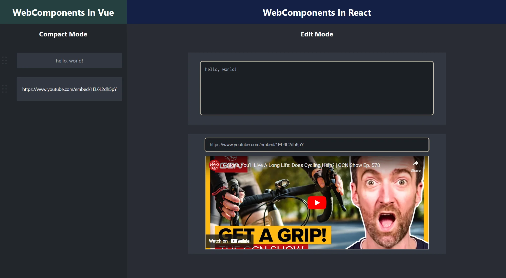

# wc-integration-demo

This is a demo project that shows how WebComponents can be used in a framework-agnostic way in the same webpage.
The project has LitElement components that get used in React and Vue components, which pass in different paramaters to the Lit Components.
This allows each framework to use the same WebComponent in a different way.

## Screenshot
